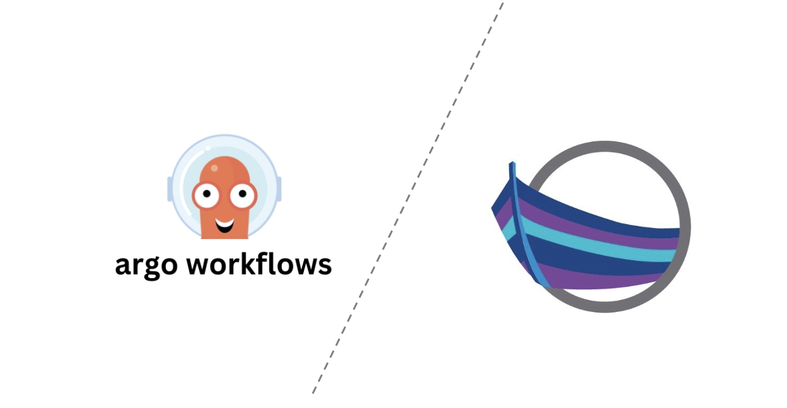

# Argo Workflows Accelerator

This is an accelerator that can be used to generate an Argo Workflows deployment which integrates with KappController.



* Install App Accelerator: (see https://docs.vmware.com/en/Tanzu-Application-Platform/1.0/tap/GUID-cert-mgr-contour-fcd-install-cert-mgr.html)
```
tanzu package available list accelerator.apps.tanzu.vmware.com --namespace tap-install
tanzu package install accelerator -p accelerator.apps.tanzu.vmware.com -v 1.0.1 -n tap-install -f resources/app-accelerator-values.yaml
Verify that package is running: tanzu package installed get accelerator -n tap-install
Get the IP address for the App Accelerator API: kubectl get service -n accelerator-system
```

Publish Accelerators:
```
tanzu plugin install --local <path-to-tanzu-cli> all
tanzu acc create argo-pipelines-kapp-acc --git-repository https://github.com/agapebondservant/sample-argo-workflow-kappcontroller-accelerator.git --git-branch main
```

## Contents
1. [Pre-requisites](#prereq)
2. [Deploy Argo Training Pipeline](#deploy)

### Deploy Pre-requisites <a name="prereq">
* Set up the following pre-requisites on your Kubernetes cluster:
[ ] Argo Workflows
[ ] Tanzu Cluster Essentials

* Set up permissions:
```
kubectl apply -f resources/rbac.yaml
kubectl apply -f resources/rbac-2.yaml
```

### Deploy Argo Training Pipeline on TAP <a name="deploy">
* From the directory root, deploy the pipeline:
```
ytt -f pipeline_app.yaml -f values.yaml | kapp deploy -a <app-name> --logs -y  -nargo -f -
```

* View progress:
```
kubectl get app <app-name> -oyaml  -nargo
```

* To delete the pipeline:
```
kapp delete -a <app-name> -y -nargo
```
